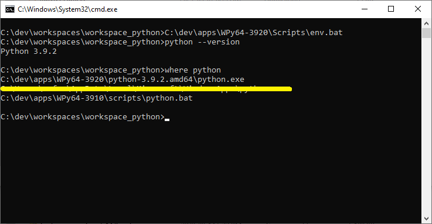
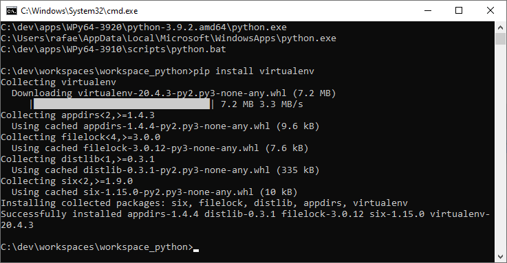
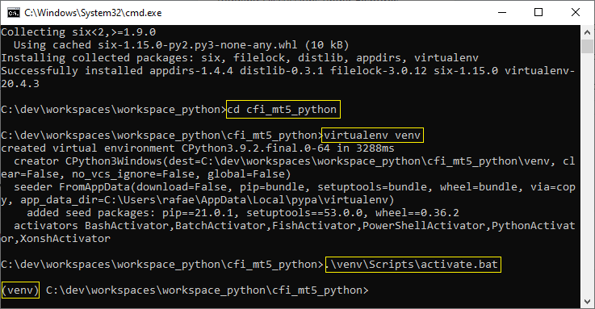
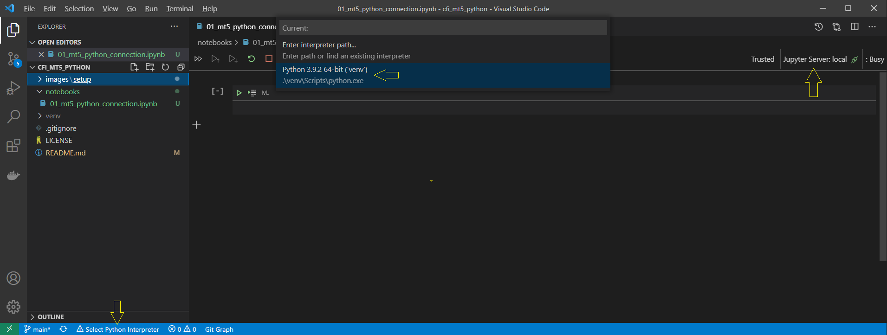
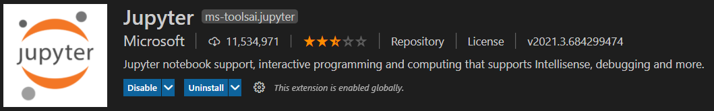

# Connecting MT5 to python

## Environment setup

For this tutorial, I assume you have Metatrader5 installed and access to a free demo account.

I will be using __VSCode__ because this is easy to get up and running, but you may choose to use your preferred `ipython` interface, like __jupyter lab__.

### Windows

__Attention:__ Many python modules are compiled and built when you install them on your machine. On Windows, you need to install the __Build Tools for Visual Studio__ to make this process run smoothly. Please, [download it from here](https://visualstudio.microsoft.com/thank-you-downloading-visual-studio/?sku=BuildTools&rel=16), install it and save your self hours of search on StackOverflow.

For python development on Windows enviroment, I recommend WinPython. It is a lightweght "portable" python setup that requires no installation and comes with no extra modules, just plain python.

The advantage of this recommended setup is that you will be able to code along without interfering with any previous python installation you may have or previously installed modules, and thus, prevent version issues.

You can download it from the [Project's Github page](https://github.com/winpython/winpython/releases/download/4.0.20210307/Winpython64-3.9.2.0dot.exe).

1. Extract the file content to a path on your PC (I will use `C:\dev\apps`).
2. This will create a folder called `WPy64-3920` under the selected extraction folder (if you used the same folder as me, the final result will be `C:\dev\apps\WPy64-3920`).
3. This is the location where your base interpreter is.
    1. Optional but recommended: create an isolated python enviroment for the tutorial, installing the `virtualenv`.
        1. Open a command prompt (windows key + `run cmd`).
        2. Run `C:\dev\apps\WPy64-3920\Scripts\env.bat`. This will setup __just that__ command prompt terminal. You must run this batch file on every terminal where you want to run python modules.
        3. To check if everything is working fine, run: `python --version` and `where python`. The result should be like this: 
        4. Install `virtualenv`: `pip install virtualenv`. Your terminal now should look like this: 
        5. Clone this repository:
            1. If you want to mimic my folder structure, run: `md C:\dev\workspaces\workspace_python\ && cd C:\dev\workspaces\workspace_python\`. This will create the folder and change the prompt to that location.
            2. Clone: `git clone https://github.com/rafaelqntn/cfi_mt5_python.git`
            3. Change the directory to the tutorial's folder: `cd cfi_mt5_python`
        6. With the command prompt in the tutorial's folder, create the `virtualenv` running: `virtualenv venv`
        7. Activate the virtualenv running: `.\venv\Scripts\activate.bat`. The result should look like this: 
        8. Install the required python modules running: `pip install -r requirements.txt`
4. Open the folder using __VSCode__ typing: `code .` (the dot "." means "current directory"). This will open the folder inside __VSCode__.
    1. Your development environment should look like this: 
    - Details to notice:
        - __VSCode__ should prompt you to install the right _extension_ to open __jupyter notebooks__ and spin up a local server for you. This is the _extension_ I am talking about: 
        - The selected python interpreter __must__ point to the interpreter where you have installed the required modules.
        - __VSCode__ must be connected to your __jupyter server__.

You can now open the jupyter notebooks and continue the tutorial.
